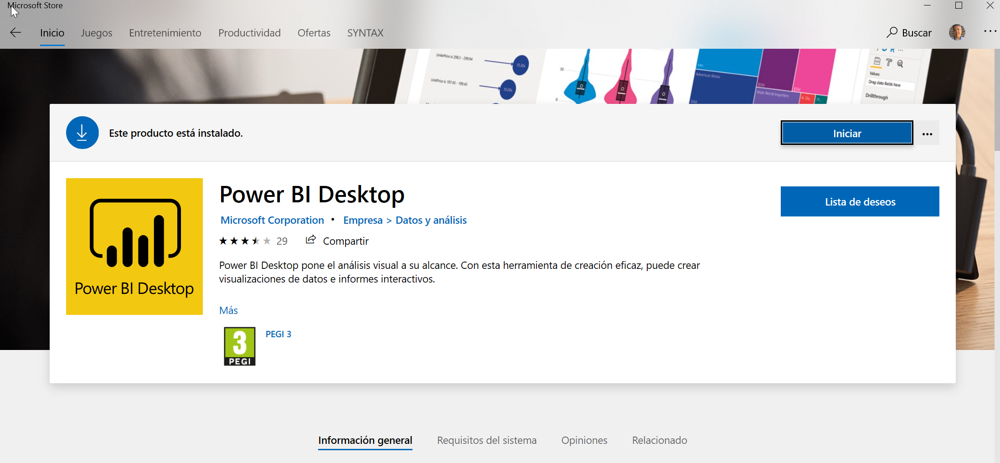
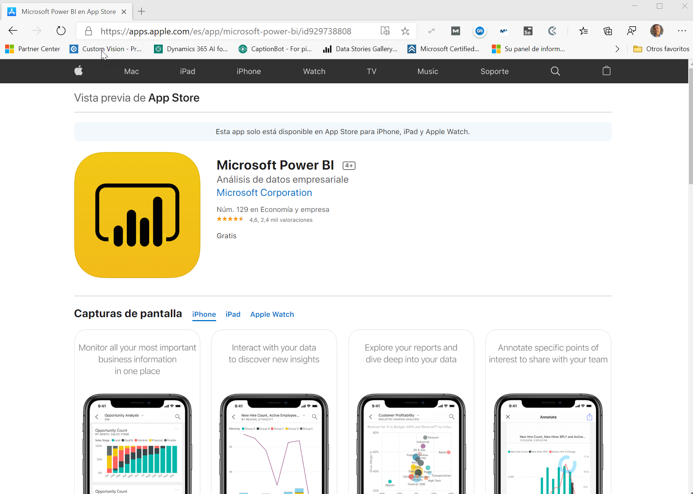
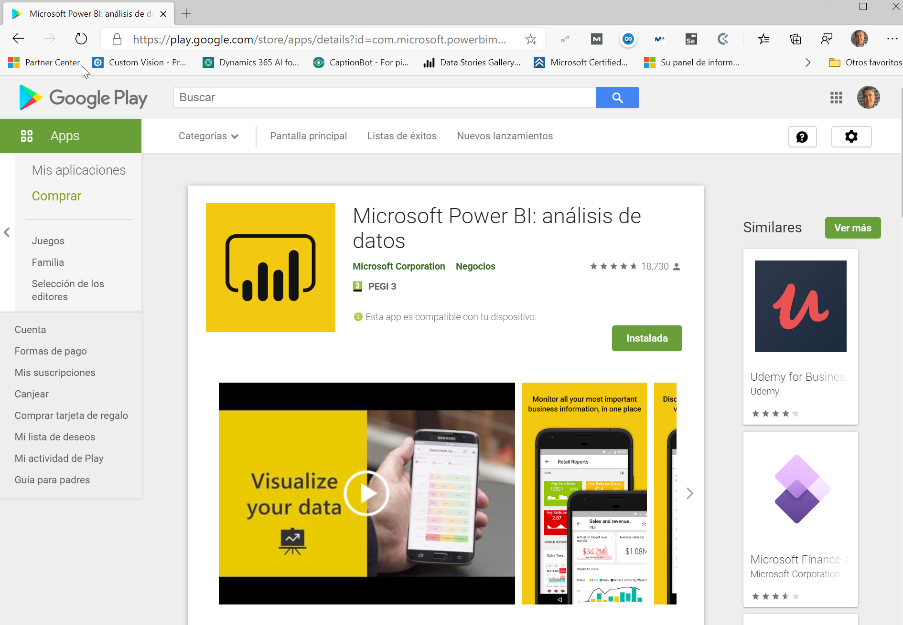

# PowerBIPorAlumnosEnCasa
Power BI Por Alumnos En Casa es una iniciativa del [Power BI Spain Users Group](https://www.pbiusergroup.com/madrid) con el objetivo de conseguir que los alumnos entre 8 y 16 años utilicen y conozcan Power BI desde sus casas para “sus datos”. Con los siguientes requisitos tendreis todo lo necesario para seguir el siguiente Video-Tutorial donde en unos 15 minutos tendremos con Power BI un **Escanner de Códigos de Alimentos En Casa**.

### Requisitos previos:
1.	No se tiene porqué tener ningún conocimiento previo, solo muchas ganas de aprender.
2.	Debéis tener instalado en el ordenador de sobremesa o portátil la aplicación Power BI Desktop que podéis descargar gratuitamente (igual vuestros padres ya os la han instalado) desde http://www.powerbi.com o desde la [Tienda de Windows 10](https://www.microsoft.com/es-es/p/power-bi-desktop/9ntxr16hnw1t):

4.	Debéis disponer de vuestra cuenta Microsoft Educativa o Profesional que utilicéis con Office 365, para publicar el informe en vuestro “Mi Área de Trabajo” en Power BI.
5.	Debéis descargaros en vuestro móvil la aplicación [Microsoft Power BI para Apple](https://apps.apple.com/es/app/microsoft-power-bi/id929738808) desde la App Store:

7.	O [Microsoft Power BI para Android](https://play.google.com/store/apps/details?id=com.microsoft.powerbim&hl=es_419) de la Play Store:

9.	Utilizaremos la base de datos abierta de Alimentos disponible en: [Open Food Fact España](https://es.openfoodfacts.org/data), como Origen de Datos tipo Web con el siguiente enlace:  https://static.openfoodfacts.org/data/en.openfoodfacts.org.products.csv con codificación del archivo Unicode UTF-8 y el carácter que separa los campos es <tab> (tabulación).

Con esto ya teneis todo lo necesario para seguir el siguiente Video donde llevaremos a cabo con Power BI un Escanner de Códigos de Alimentos En Casa, AHORA OS TOCA A VOSOTROS!!

VER VIDEO: [https://youtu.be/FVofzYGiiQs](https://youtu.be/FVofzYGiiQs)
